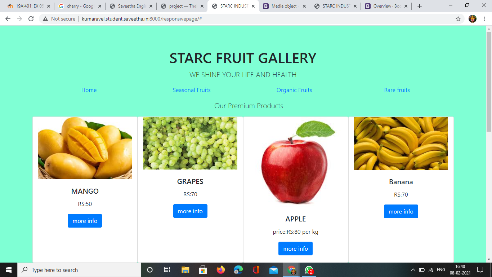
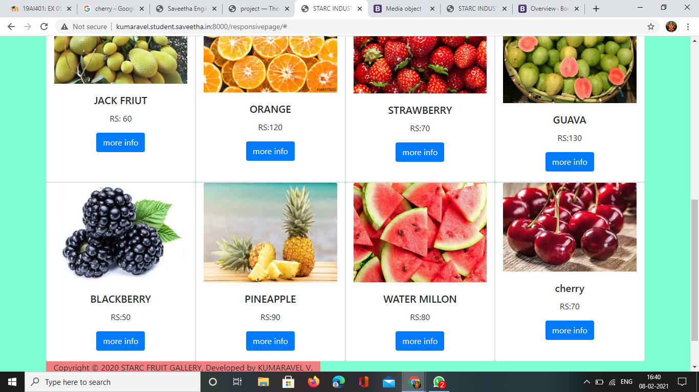
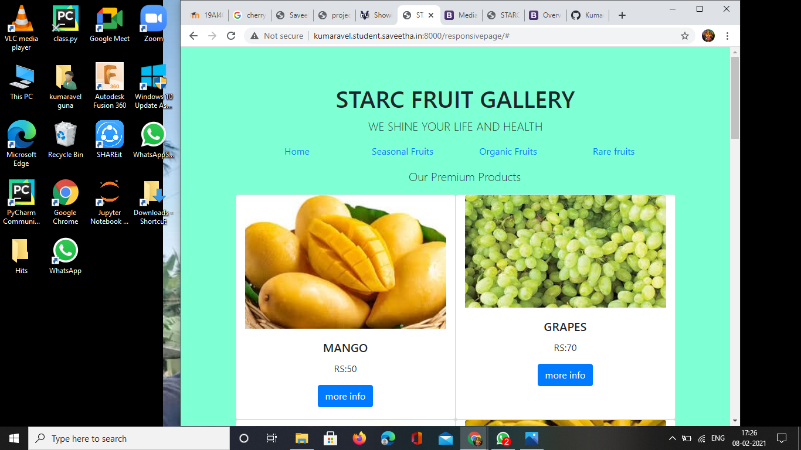
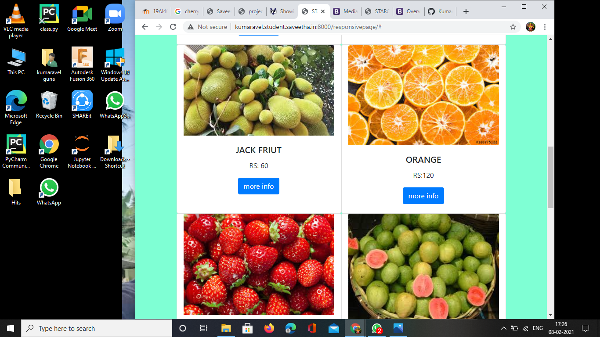
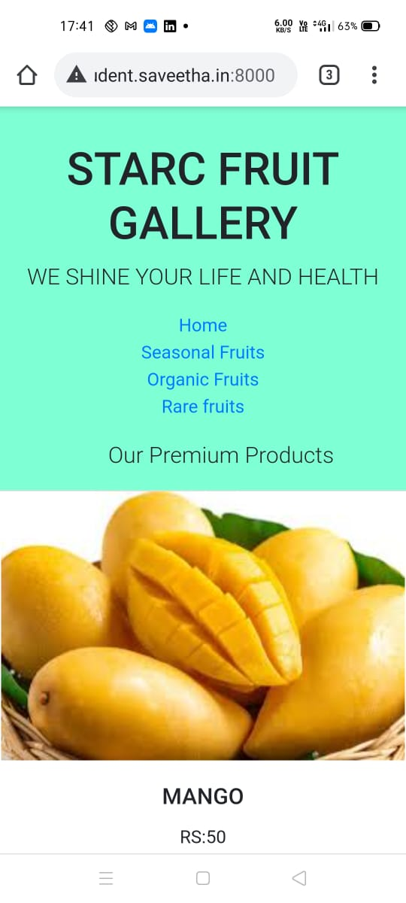
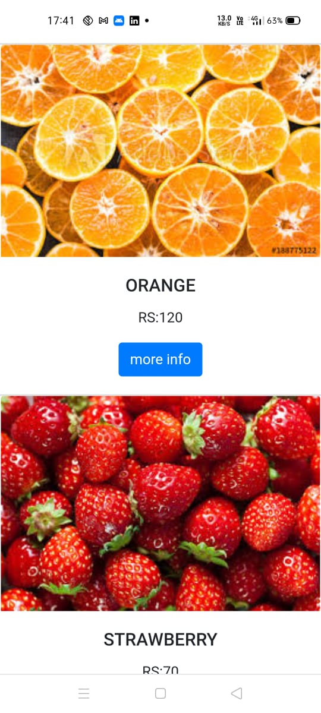
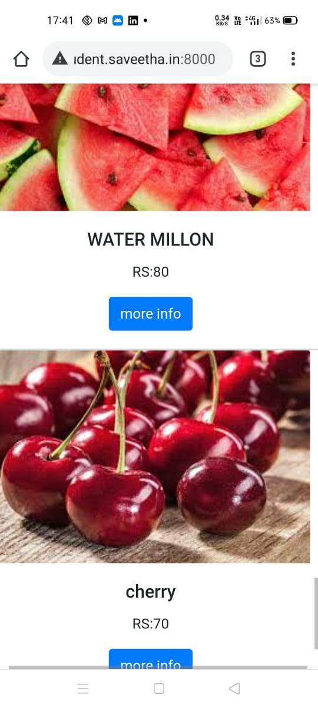
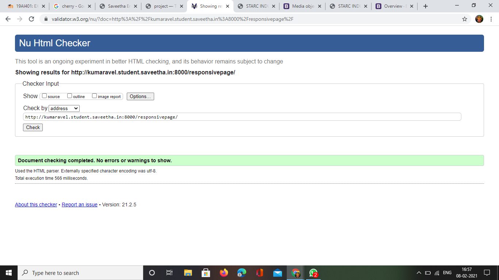

# Design of Responsive Website
## AIM:
To design a responsive website with two break points.

## DESIGN STEPS:
### Step 1: 
Requirement collection.
### Step 2:
Creating the layout using HTML and CSS.
### Step 3:
Updating the sample content.
### Step 4:
Choose the appropriate style and color scheme.
### Step 5:
Validate the layout in various browsers.
### Step 6:
Validate the HTML code.
### Step 7:
Create a database model and migrate the database.
### Step 8:
Retrieve data from database and display it in a dynamic webpage.
### Step 9:
Publish the website in the given URL.

## PROGRAM

### reponcivepage.html
```
<!doctype html>
<html lang="en">

<head>
    <!-- Required meta tags -->
    <meta charset="utf-8">
    <meta name="viewport" content="width=device-width, initial-scale=1, shrink-to-fit=no">

    <!-- Bootstrap CSS -->
    <link rel="stylesheet" href="https://maxcdn.bootstrapcdn.com/bootstrap/4.0.0/css/bootstrap.min.css"
        integrity="sha384-Gn5384xqQ1aoWXA+058RXPxPg6fy4IWvTNh0E263XmFcJlSAwiGgFAW/dAiS6JXm" crossorigin="anonymous">

    <title>STARC INDUSTRIES</title>
</head>

<body>
    <div class="jumbotron jumbotron-fluid" style="background-color:aquamarine;">
        <div class="container text-center">
            <h1>STARC FRUIT GALLERY</h1>
            <p class="lead">WE SHINE YOUR LIFE AND HEALTH</p>
        </div>
        <div class="container text-center">

            <div class="row">
                <div class="col-12 col-md-3 text-center"><a href='#'>Home</a>
                </div>
                <div class="col-12 col-md-3 text-center"><a href='#'>Seasonal Fruits</a>
                </div>
                <div class="col-12 col-md-3 text-center"><a href='#'>Organic Fruits</a>
                </div>
                <div class="col-12 col-md-3 text-center"><a href='#'>Rare fruits</a>
                </div>
            </div>
            <div class="row">
                <div class="col-12 lead text-center m-3">
                    Our Premium Products
                </div>
                <div class="row">
                    <div class="card col-12 col-md-6 col-lg-3">
                        
                        <div class="card-body">
                            <h5 class="card-title">MANGO</h5>
                            <p class="card-text">RS:50</p>
                            <a href="#" class="btn btn-primary">more info</a>
                        </div>
                    </div>

                    <div class="card col-12 col-md-6 col-lg-3">
                        
                        <div class="card-body">
                            <h5 class="card-title">GRAPES</h5>
                            <p class="card-text">RS:70</p>
                            <a href="#" class="btn btn-primary">more info</a>
                        </div>
                    </div>

                    <div class="card col-12 col-md-6 col-lg-3">
                        
                        <div class="card-body">
                            <h5 class="card-title">APPLE</h5>
                            <p class="card-text">price:RS:80 per kg</p>
                            <a href="#" class="btn btn-primary">more info</a>
                        </div>
                    </div>


                    <div class="card col-12 col-md-6 col-lg-3">
                        
                        <div class="card-body">
                            <h5 class="card-title">Banana</h5>
                            <p class="card-text">RS:70</p>
                            <a href="#" class="btn btn-primary">more info</a>
                        </div>
                    </div>

                    <div class="card col-12 col-md-6 col-lg-3">
                        
                        <div class="card-body">
                            <h5 class="card-title">JACK FRIUT</h5>
                            <p class="card-text">RS: 60</p>
                            <a href="#" class="btn btn-primary">more info</a>
                        </div>
                    </div>

                    <div class="card col-12 col-md-6 col-lg-3">
                        
                        <div class="card-body">
                            <h5 class="card-title">ORANGE</h5>
                            <p class="card-text">RS:120</p>
                            <a href="#" class="btn btn-primary">more info</a>
                        </div>
                    </div>

                    <div class="card col-12 col-md-6 col-lg-3">
                        
                        <div class="card-body">
                            <h5 class="card-title">STRAWBERRY</h5>
                            <p class="card-text">RS:70</p>
                            <a href="#" class="btn btn-primary">more info</a>
                        </div>
                    </div>

                    <div class="card col-12 col-md-6 col-lg-3">
                        
                        <div class="card-body">
                            <h5 class="card-title">GUAVA</h5>
                            <p class="card-text">RS:130</p>
                            <a href="#" class="btn btn-primary">more info</a>
                        </div>
                    </div>

                    <div class="card col-12 col-md-6 col-lg-3">
                        
                        <div class="card-body">
                            <h5 class="card-title">BLACKBERRY</h5>
                            <p class="card-text">RS:50</p>
                            <a href="#" class="btn btn-primary">more info</a>
                        </div>
                    </div>

                    <div class="card col-12 col-md-6 col-lg-3">
                        
                        <div class="card-body">
                            <h5 class="card-title">PINEAPPLE</h5>
                            <p class="card-text">RS:90</p>
                            <a href="#" class="btn btn-primary">more info</a>
                        </div>
                    </div>

                    <div class="card col-12 col-md-6 col-lg-3">
                        
                        <div class="card-body">
                            <h5 class="card-title">WATER MILLON</h5>
                            <p class="card-text">RS:80</p>
                            <a href="#" class="btn btn-primary">more info</a>
                        </div>
                    </div>

                    <div class="card col-12 col-md-6 col-lg-3">
                        
                        <div class="card-body">
                            <h5 class="card-title">cherry</h5>
                            <p class="card-text">RS:70</p>
                            <a href="#" class="btn btn-primary">more info</a>
                        </div>
                    </div>
                </div>
            </div>
            <div class="row">
                <div class="col-md-12" style="background-color: lightcoral;">
                    Copyright © 2020 STARC FRUIT GALLERY, Developed by KUMARAVEL V.
                </div>
            </div>
        </div>
    </div>
    <!-- Optional JavaScript -->
    <!-- jQuery first, then Popper.js, then Bootstrap JS -->
    <script src="https://code.jquery.com/jquery-3.2.1.slim.min.js"
        integrity="sha384-KJ3o2DKtIkvYIK3UENzmM7KCkRr/rE9/Qpg6aAZGJwFDMVNA/GpGFF93hXpG5KkN"
        crossorigin="anonymous"></script>
    <script src="https://cdnjs.cloudflare.com/ajax/libs/popper.js/1.12.9/umd/popper.min.js"
        integrity="sha384-ApNbgh9B+Y1QKtv3Rn7W3mgPxhU9K/ScQsAP7hUibX39j7fakFPskvXusvfa0b4Q"
        crossorigin="anonymous"></script>
    <script src="https://maxcdn.bootstrapcdn.com/bootstrap/4.0.0/js/bootstrap.min.js"
        integrity="sha384-JZR6Spejh4U02d8jOt6vLEHfe/JQGiRRSQQxSfFWpi1MquVdAyjUar5+76PVCmYl"
        crossorigin="anonymous"></script>
</body>

</html>

```

## OUTPUT:

















## CODE VALIDATION REPORT:



## RESULT:
Thus a website is designed for the chip manufacturing company and is hosted in the URL http://kumaravel.student.saveetha.in:8000/responsivepage. HTML code is validated.
